# VBS直播推流软件使用教程

## 版本
V1.0

## 功能说明
威尔定制版本的VBS直播工具，专门针对180°3D VR直播的推流软件。

## 引言
* 在阅读本教程之前，请确定您已经完成了与威尔云团队的接触， 
并获得了威尔定制版本的VBS推流工具。

* 推流PC硬件支持 ：NVIDIA 960M及以上显卡 
支持相机 ：ZCAM™ K1 Pro 

* http://www.z-cam.com/180-vr-camera-k1-pro/*
* 注：本软件支持本地模拟数据，也支持通过VR相机实时输入

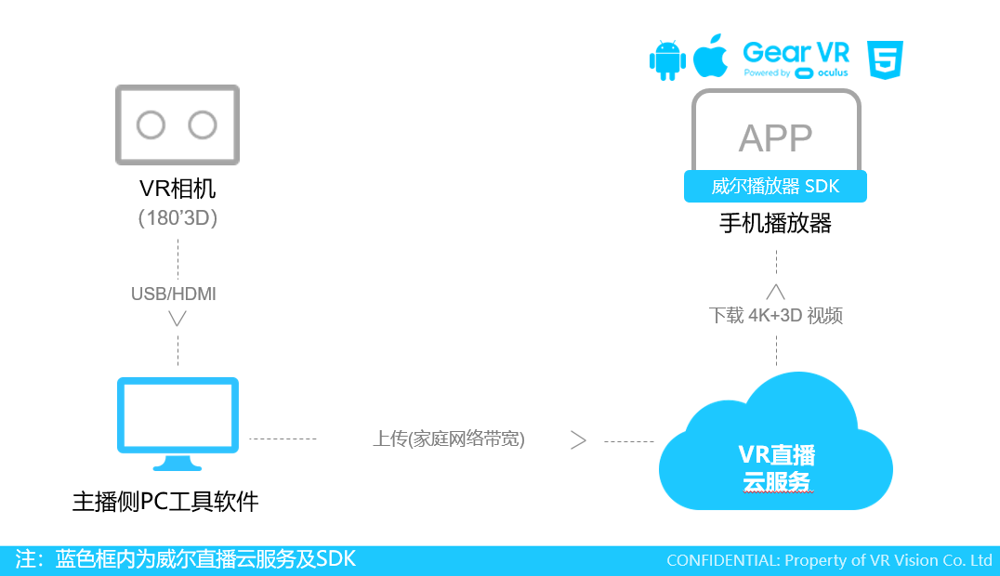

## 联系方式
* 邮箱： business@vrviu.com     
* 电话：0755-8696 0615   
* 微信公众号： 威尔云           
* 微信：vrviu001

## 使用步骤
### 1. 保证VR相机和推流PC处在同一个局域网内
我们可以选择通过一个路由器，将ZCAM相机的网线，推流PC机的网线连在路由器，这样即可以搭建一个小型的局域网，进行实时画面输入的直播推流。

### 2. 运行VBS，并获取相机图像解压VBS 软件包，进入VBS的路径文件夹 ../VBS/bin/64bit，
*  1）在文件夹中寻找 aqua.cfg，不修改则默认采用预录制的模拟数据，作为视频源；
*  2）重命名aqua.cfg 为 aqua01.cfg，则采用ZCAM 相机采集实时数据作为视频源；  
*  3）在相同路径下，打开 obs64.exe；

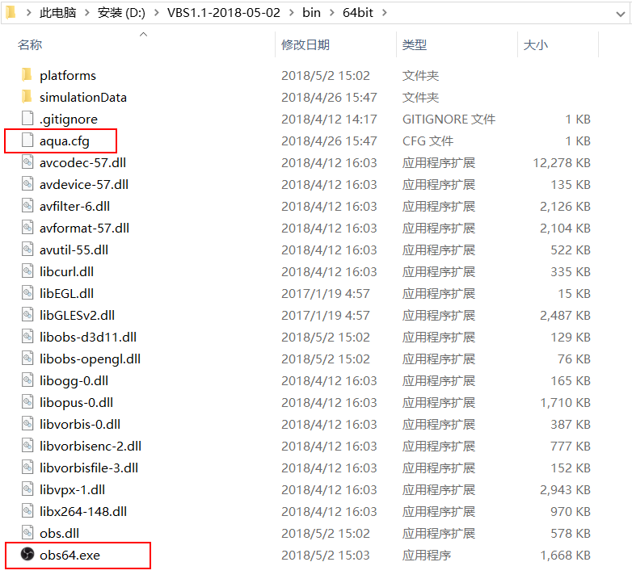

* 4） 设置-> 高级-> 渲染器 选择OpenGL

 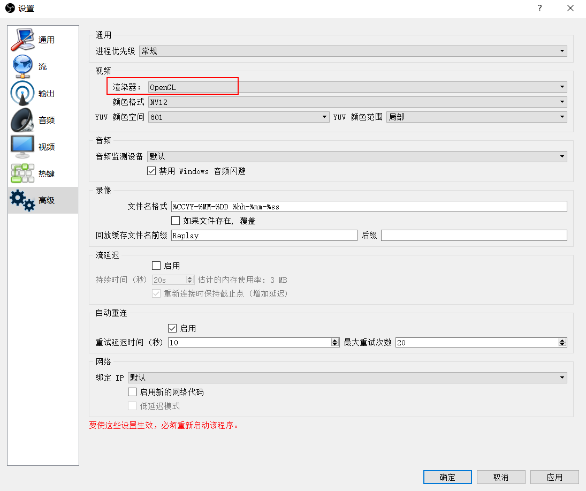
 
* 5 ) 保存设置，重启VBS软件。
* 6 ）
在左下角的场景中，点击“+”新建场景，然后在来源中，点击“+”新建，在菜单中选择 ZCAM。

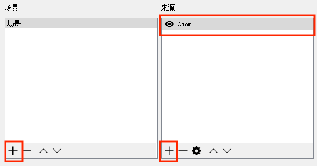

* 目前屏幕上应该还是黑屏，不用着急。此时在黑屏上，右键鼠标并选择“属性”，会弹出ZCAM属性窗口，我们选择ZCAM最高的“2880P”分辨率（每个镜头为2880x2880，5760x2880图像），然后点选“Detect”，去自动检测相机IP获取图像。等待1-2秒（取决于机器），就会出现ZCAM的图像了。

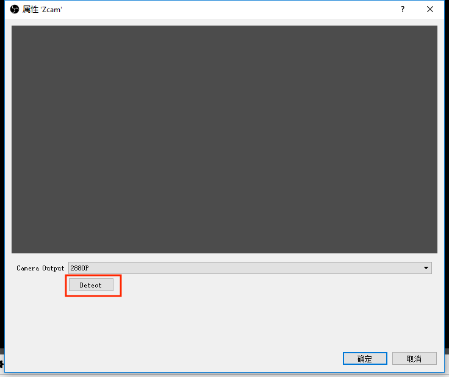

* 7 ）添加本地视频模拟数据方法：

在左下角在来源中，点击“+”新建，在菜单中选择 “媒体源”；
选择本地已经有的180°3D视频源，勾选循环播放，即可。

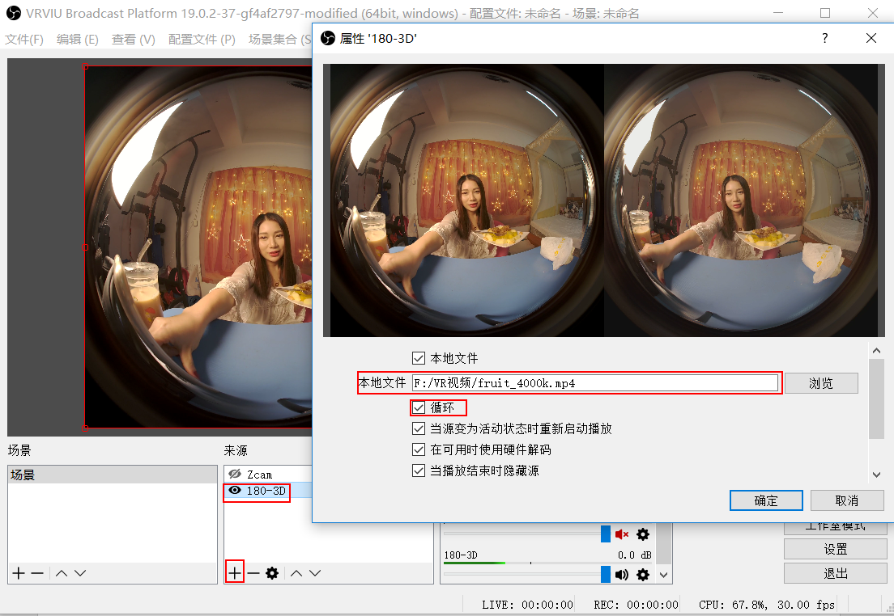

### 3.  调整画面畸变和直播参数
* 1 ) 第一次获取到的图像应该是非常大的6K鱼眼图像，我们需要对图像做反畸变，将它变为我们可以接受的正常画面。

* 2 ) 在图像上右键鼠标，选择“滤镜”弹出滤镜窗口。我们在左下角点击“+”增添并选择“fisheyeFilter”，专门适配鱼眼镜头的滤镜。这里我们已经为大家写好了自动反畸变的功能，并将6K源下采样至了4K去适配播放器，这里不需要修改任何参数，点击“关闭”。
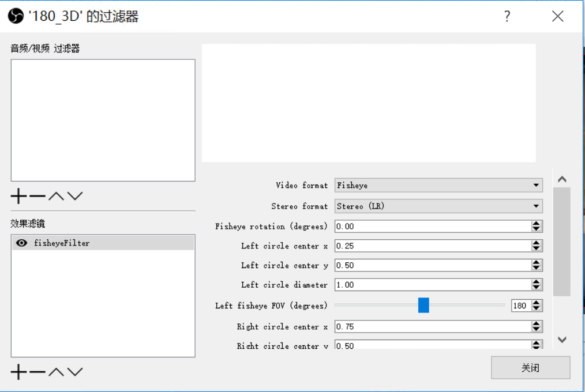

#### 提示：如果我按照上述操作，获得了上下倒置的图像该如何操作？

* 3 ) 由于ZCAM相机本身并没有规定画面方向，所以获取图像有时会出现上下或左右倒置的状况。我们可以通过：
* 4）重启VBS和ZCAM相机，再次运行看是否满足我们的要求；
* 5）我们可以不管进入是否获取到了正确方向的图像，在图像上右键鼠标，选择“变换”，尝试画面的旋转或翻转来达到期望看到的效果。

### 4.  直播推流

在完成了ZCAM图像的获取和调试，现在可以将图像直播推流到线上啦！在VBS右下角处点击“设置”，进入设置窗口。

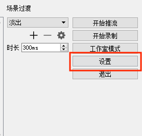

* 1）选择“流”，填写需要推流的地址，修改完成点击“应用”。

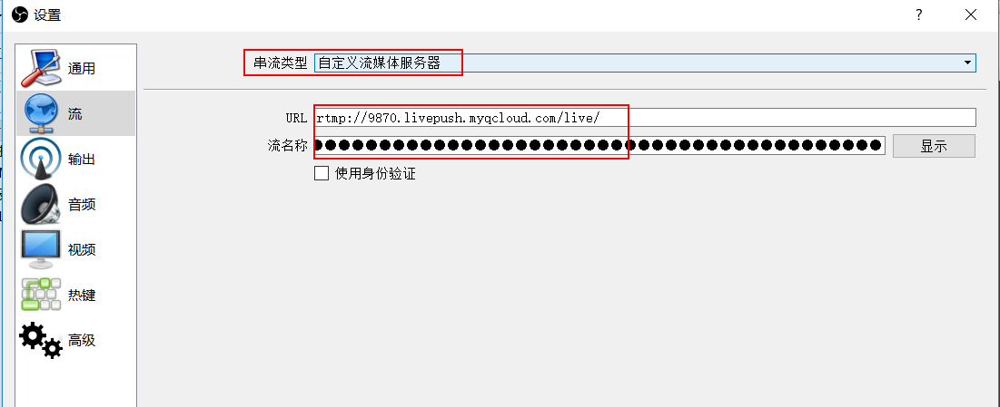

 

推流地址URL ： **rtmp://9870.livepush.myqcloud.com/live** 

流名称（key）：**9870_333c727a57?bizid=9870&txSecret=867ec2e82b6f3c4539ff4b879d017816&txTime=5B06E17F**

*（ 注：若地址失效，可联系威尔技术团队免费获取 ）*

* 2）选择“输入”，并根据需要选择“简单/高级”模式，选择  硬件“NVENC” 编码器（该版本只支持硬件编码），选择推流码率（推荐4Mbps），设置完成后点击“应用”。

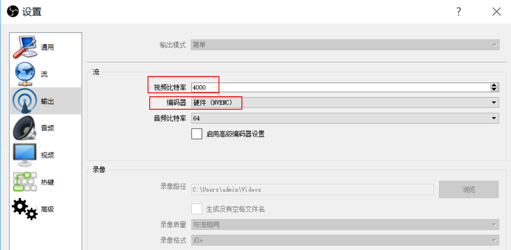 

* 3）前往“视频”，默认这里的分辨率应与fisheye鱼眼滤镜中显示相同，基础分辨率4096x2048，输出分辨率4096x2048，FPS 30。 完成后点击“应用”，点击“确认”关闭设置窗口。
 
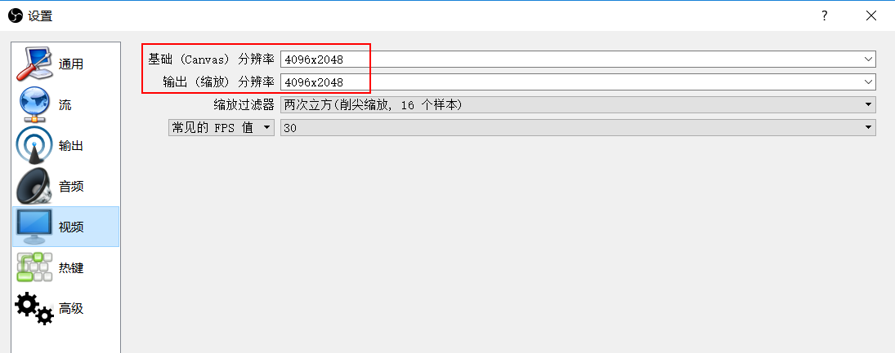 

* 4）回到VBS主界面，点击右下角的“开始推流”，直播内容就可以观看了。

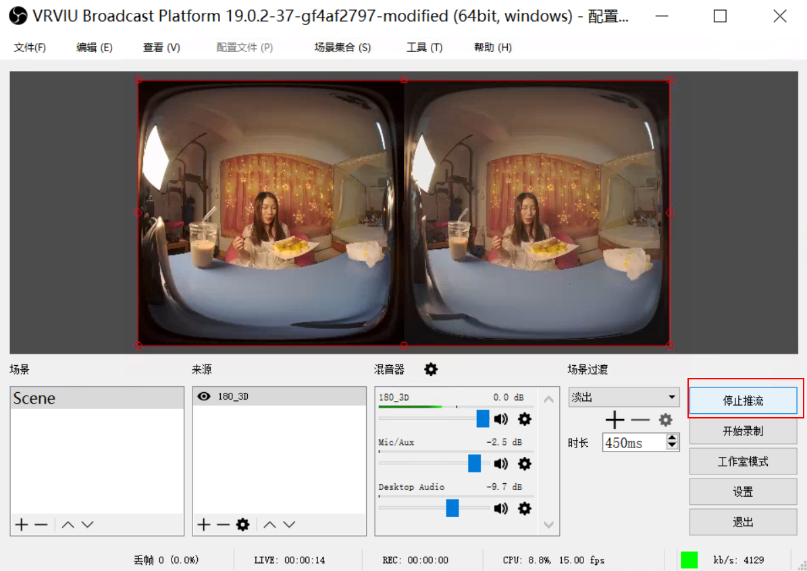  

### 5.  播放观看
由于播放内容采用了威尔云研发的FE算法，必须要配合威尔云的播放器App进行体验和测试。

## 【版权声明】
© 2016-2020 深圳威尔视觉传媒有限公司 版权所有

*官网地址：www.vrviu.com*

*本⽂档著作权归威尔视觉单独所有，未经威尔视觉事先书⾯许可，任何主体不得以任何形式复制、修改、抄袭、传播部分或全部内容。* 

